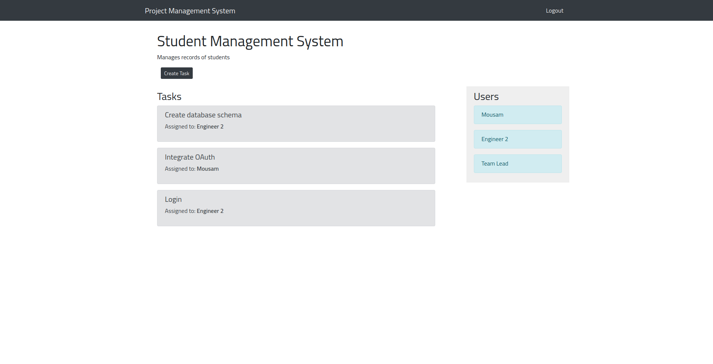

# Project management system - Front End

## Instruction to run the project

1. Create a copy of `.env.example` under the file name `.env` and make necessary changes.
2. Run the following commands

   ```sh
     npm install
     npm start

     # OR

     yarn
     yarn start
   ```

## Screenshots

#### Login Page


#### Home Page


#### Create User Interface


#### Create Task Interface


#### Project Page



#### Create Task


